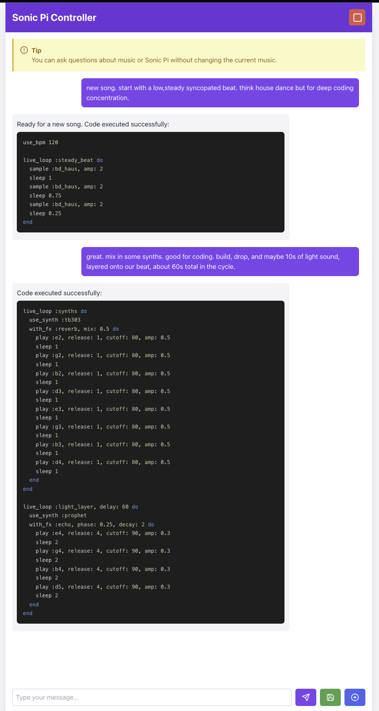

# Sonic Pi Controller

Sonic Pi Controller is an interactive web application that allows users to create and manipulate music using Sonic Pi through a chat-like interface powered by AI. This project combines the creativity of live coding music with the intelligence of large language models to create a unique music generation experience.



## Features

- AI-powered chat interface for generating Sonic Pi code
- Real-time music generation and playback using Sonic Pi
- Code highlighting for better readability
- Ability to save generated code
- Start new chat sessions while preserving current music
- Stop music playback instantly
- Integration with Azure OpenAI for intelligent responses

## Prerequisites

- Python 3.8+
- Node.js 14+
- Sonic Pi 4.0+
- Azure OpenAI API access

## Setup

### Sonic Pi

Get and install [Sonic Pi](https://sonic-pi.net/)

Install the CLI:

```bash
  sudo gem install sonic-pi-cli4
```

### Backend

1. Clone the repository:

   ```bash
   git clone https://github.com/yourusername/sonic-pi-controller.git
   cd sonic-pi-controller
   ```

2. Create a virtual environment and activate it:

   ```bash
   python -m venv venv
   source venv/bin/activate  # On Windows, use `venv\Scripts\activate`
   ```

3. Install the required Python packages:

   ```bash
   pip install -r requirements.txt
   ```

4. Set up your environment variables:
   Create a `.env` file in the root directory and add your Azure OpenAI credentials:

   ```bash
   AZURE_OPENAI_API_KEY=your_api_key
   AZURE_OPENAI_ENDPOINT=your_endpoint
   AZURE_OPENAI_DEPLOYMENT_NAME=your_deployment_name
   ```

5. Run the FastAPI server:

   ```bash
   uvicorn main:app --reload
   ```

### Frontend

1. Navigate to the frontend directory:

   ```bash
   cd frontend
   ```

2. Install the required npm packages:

   ```bash
   npm install
   ```

3. Create a `.env` file in the frontend directory and add:

   ```bash
   REACT_APP_API_URL=http://localhost:8000
   ```

4. Start the React development server:

   ```bash
   npm start
   ```

## Usage

1. Ensure Sonic Pi is running on your system.
2. Open your web browser and navigate to `http://localhost:3000`.
3. Start chatting with the AI to generate music!
   - Use natural language to describe the kind of music you want to create.
   - The AI will generate Sonic Pi code based on your input.
   - The generated code will be automatically executed in Sonic Pi.
4. Use the "New Chat" button to start a fresh conversation without stopping the current music.
5. Use the "Stop" button to immediately stop all music playback.
6. Use the "Save" button to save the current Sonic Pi code.

## Contributing

Contributions are welcome! Please feel free to submit a Pull Request.

## License

This project is licensed under the MIT License - see the [LICENSE](LICENSE) file for details.

## Acknowledgements

- [Sonic Pi](https://sonic-pi.net/) by Sam Aaron
- [FastAPI](https://fastapi.tiangolo.com/)
- [React](https://reactjs.org/)
- [Azure OpenAI](https://azure.microsoft.com/en-us/products/cognitive-services/openai-service/)